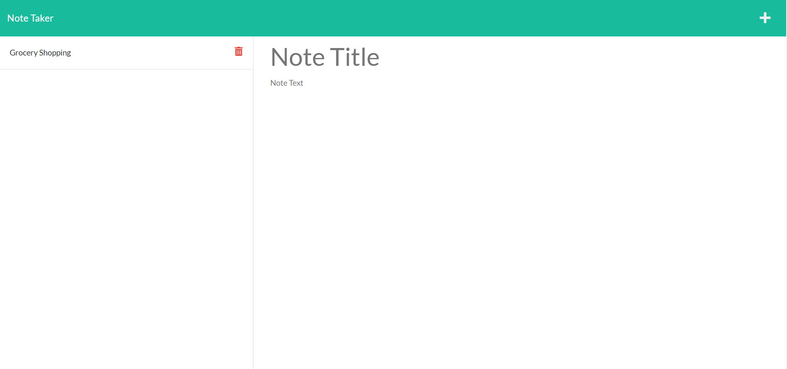

# NoteLock

## Description

NoteLock was made to be a note taking app built using express.js. It allows a user to add and remove notes as needed. When both fields have been filled out, a save button appears and is used to save the note to the task manager.

[NoteLock](https://note-lock.herokuapp.com/index.html)

## Table of Contents 

[Description](#description)
[Installation](#installation)
[Usage](#usage)
[License](#license)
[Contribute](#contribute)
[Tests](#tests)
[Questions](#questions)

## Installation

To use NoteLock, users may go to the NoteLock web deployment. Should they desire to use the code, they would clone the repository to their own computer and edit.

## Usage

This application would be used to keep track of tasks.

## License

No license used.

## Contribute
This app does not use contributions.

## Questions

GitHub: [Elenalaree](https://github.com/elenalaree)

